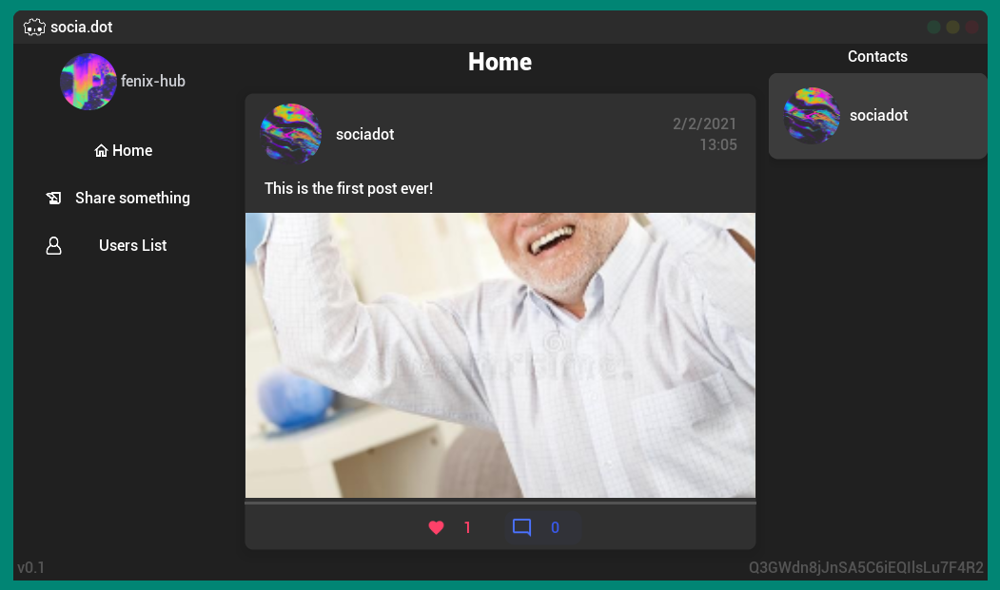

# Sociadot

**socia.dot** is an open-source frontend for a minimalistic "social netowrk app" proof-of-concept.
It was developed as complete showcase for our [GodotFirebase](https://github.com/GodotNuts/GodotFirebase) addon for Godot Engine, demonstrating various applications of our APIs to interact with Firebase, such as: User Authentication; User management; Firestore, Realtime Database and Storage management and interaction; Offline and Cache management. All these features are currently available and testable just installing our plugin in your own Godot Engine's project and following our tutorials. You can also see how I implemented them just looking at the source code!
Every single feature of this app is working thanks to the perfect blend of Godot Engine's elasticity in being able to easily create fully customizable and programmable user interface components, and all Firebase backend features exposed by our library and supporting multiple protocols and logics.

### socia.dot is:
• open-source: you can just download the source code from Github and modify it in your own Godot Engine proget just to customize your own frontend;
• multiplatform: since it is powered with the FOSS game engine [Godot Engine](https://godotengine.org/), which allows to officialy export binaries for multiple platforms (Windows, Linux, Mac, Android, iOS, HTML), and considering eventual custom export templates for single boarded devices and private platforms, it could work nearly everywhere;
• elastic: together with the ability to export with multiple platforms, interfaces are completely adaptable to any device based on its OS or resolution, just using custom logic in GDScript scripting language;
• serverless: there is no server handling data other than Firebase itself, and being open-sourced socia.dot exposes any information saved on Firebase's databases, from images to chats;
• modular: as said, Firebase interaction is based on our GodotFirebase library, which is being developed and maintained modular by default. Eventually, this service could be replaced by any other market or custom service/dbms, just replacing the script containing all the REST calls ([RequestManager.gd](https://github.com/GodotNuts/FirebaseDemo-SociaDot/blob/main/main/scripts/requests_manager.gd)).

The only purpose of socia.dot was to showcase most of the features implemented by our library, re-creating a real use-case inspired by one of the environments most known to handle sync/async human interactions, data and media content transfers, data storage and events management: social networks.
Thus, these are the features completely available thanks to GodotFirebase, using Firebase as a backend, and implemented in socia.dot to test:
- Personal profile creation with an avatar and a email(fake)/password combination
- Images and text sharing through posts
- Social networking, "connecting" to other users that use the platform and visiting their profile
- Realtime chat with other users only if "connected"
- Realtime comments and likes on any post on the platform by other users

socia.dot will never claim to be a social network alternative, exposing any kind of perfect social network structure as an app. This is just a proof-of-concept, that was really fun to develop with GodotNuts team, in order to have a little product to expose our work on GodotFirebase addon other than game; and an actual challenge to take, developing this in a couple of weeks in total and having fun polishing it between UIs and logics.

### Resources used:
- [Godot Engine](https://godotengine.org/), to build the frontend and implement the backend interactions
- [GodotFirebase](https://github.com/GodotNuts/GodotFirebase), our addon developed for Godot Engine in order to interact with Firebase
- [GodotFirebase-UI](https://github.com/GodotNuts/GodotFirebase-UI), a plug'n'play UI components library we developed for Godot which implements GodotFirebase APIs out of the box (Authentication Components, Buttons, etc.)

## Special Thanks
• **The whole GodotNuts team**, that helped me a lot during this journey discussing with me on our Discord and testing the app
• **Fabio (faless) Alessandrelli**, current Godot's HTML5 maintainer, for the amount of work he has done on HTML5 support, and the help he specifically gave us to make this project work also on browser as on any other platform
• **socia.dot autochthonous community**, which surprisingly showed up in the app itself, sharing a lot of suggestions after the first tweet ever made about this project
• **Godot Engine**, that made everything of this possible

@ 2021 fenix-hub

