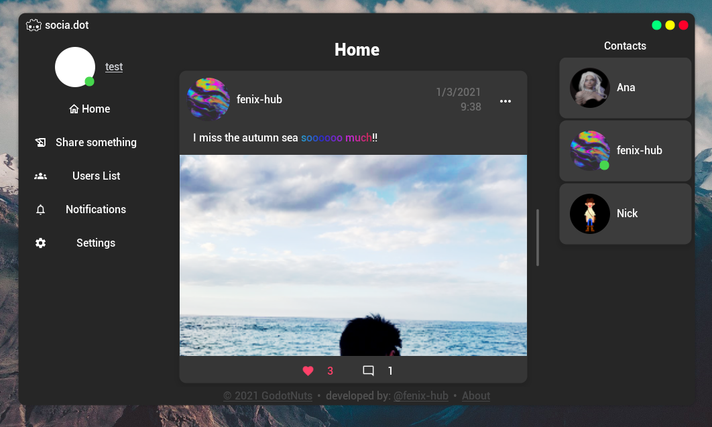

# socia.dot  
socia.dot is a minimalistic open frontend, social network clone (like Instagram, Facebook, Twitter) completely developed with Godot in GDScript, built on top of our GodotFirebase addon as a backend interface for Firebase. This is just a Demo to give a general overview about all the features provided by GodotFirebase (Authentication, Firestore, Realtime Database, Storage).  

## Libraries
This demo uses our [GodotFirebase](https://github.com/GodotNuts/GodotFirebase) addon to rely completely on Firebase as a backend.  
To run this project locally, please install and configure [GodotFirebase](https://github.com/GodotNuts/GodotFirebase) with your credentials.  

This demo also uses some UI components provided by [GodotFirebase-UI](https://github.com/GodotNuts/GodotFirebase-UI), a library containing drag-n-drop components to speed up the development of UI components for Firebase.  

## Live Demo
Some live demos hosted by our team are available here in each release.  
You can [find them here](https://github.com/GodotNuts/FirebaseDemo-SociaDot/releases)!

